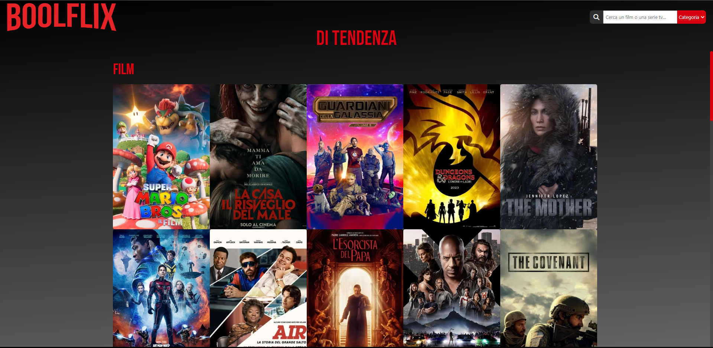

Esercizio: Boolflix

Nome Repo: vite-boolflix

Descrizione:
Replica della logica siti per la visione di film e serie tv utilizzando le API.
Fonte API: https://www.themoviedb.org

 <h1 align="center">Anteprima<h1>

